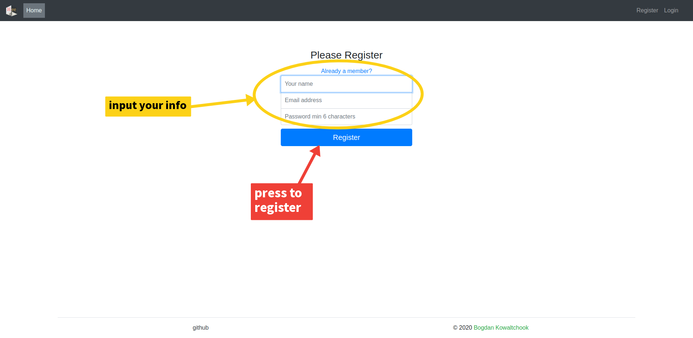
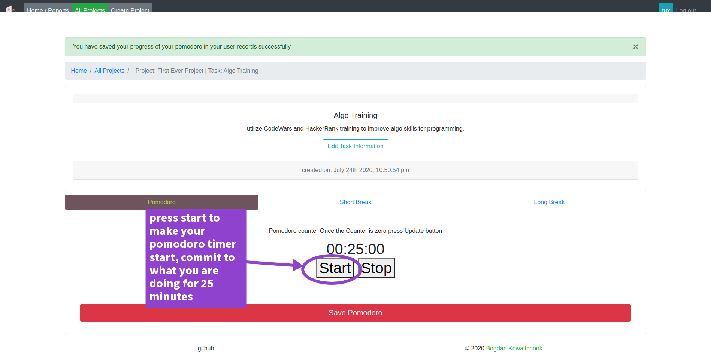

# heed-dot-place

# Project&#39;s Name: heed.place

Description: a web app that utilizes task management and Pomodoro timer technique for better productivity. With Heed-dot-place app you are able to manage your tasks in organized manner and record your pomodoro focus progress and see said progress report in the app to better gauge where you are putting the most of your productive time. Happy focus time.

# Visual representation of Pomodoro technique and how to use it:

# Technologies used in app:

- Bootstrap frontend framework - [https://getbootstrap.com/](https://getbootstrap.com/)
- Nodje.js javascript runtime - [https://nodejs.org/](https://nodejs.org/)
- Express javascript framework - [https://expressjs.com/](https://expressjs.com/)
- EJS embedded javascript template engine - [https://ejs.co/](https://ejs.co/)
- Passportjs authentication middleware for Nodje.js - [http://www.passportjs.org/](http://www.passportjs.org/)
  - Passport-local Strategy - [https://github.com/jaredhanson/passport-local](https://github.com/jaredhanson/passport-local)

- Bcryptjs for hashing/salting password for security - [https://github.com/dcodeIO/bcrypt.js/](https://github.com/dcodeIO/bcrypt.js/)
- easytimer.js library for countdown functionality - [https://github.com/albert-gonzalez/easytimer.js/](https://github.com/albert-gonzalez/easytimer.js/)
- Chart.js for displaying progress reports to users via visual representation of data - [https://www.chartjs.org/](https://www.chartjs.org/)
- MongoDB document-based database - [https://www.mongodb.com/](https://www.mongodb.com/)
- Mongoose - elegant Mongodb object modeling for Node.js - [https://mongoosejs.com/](https://mongoosejs.com/)
- Connect-mongo npm package to use session and connect to database in session - [https://www.npmjs.com/package/connect-mongo](https://www.npmjs.com/package/connect-mongo)
- Express-Validator set of middleware for validating users&#39; login data and functions - [https://express-validator.github.io/docs/](https://express-validator.github.io/docs/)
- Connect-flash for messages display for users - [https://www.npmjs.com/package/connect-flash](https://www.npmjs.com/package/connect-flash)
- Express-session session middleware for cookies - [https://www.npmjs.com/package/express-session](https://www.npmjs.com/package/express-session)
- Momentjs for converting unixTimeStamps to Human-Readable time - [https://momentjs.com/](https://momentjs.com/)
- Method-override npm package to stay faithful to Restful API specification of GET, POST, PUT, DELETE http verbs - [https://www.npmjs.com/package/method-override](https://www.npmjs.com/package/method-override)
- Bootstrap colorPicker - [https://www.templatemonster.com/blog/tutorial-build-a-color-picker-with-jquery-and-bootstrap/](https://www.templatemonster.com/blog/tutorial-build-a-color-picker-with-jquery-and-bootstrap/)

# Assets Used:
musical alert ringtones for end of pomodoro, short and long break sounds are generously created and provided by Wolf Asylum artist - https://wolfasylum.com/

# Visual Guide on how to use the app:

### Step 1:

register for an account.

### Step 2:

input your register information and press Register.

### Step 3:

input your credentials you registered with and press Sign In button.

### Step 4:

once you are logged in you will be redirected to Home/Reports page, and if you are brand new without any data recorded this page will appear to be blank, but don't worry to more you use the app the Home/Reports page will populate your data to show in visual way what you spend time on focusing.

### Step 5:

first you need to create a project or first category for a project but since you don't have any categories created you have ability to create simultaneously project and category for it.

### Step 6:

once you have created a project and parent category for it you can now create a task for said project and start your focus time.

### Step 7:

once the task is created you will be taken to task home where there availability of pomodoro timer and its corresponding breaks arrive. Once you are ready to commit to uninterrupted 25 minutes on your task press Start on the pomodoro counter and once you hear musical ringtone and countdown is zero then you should save your pomodoro progress via 'Save Pomodoro' button which will pop up a modal to verify that you want to save your progress.

### Step 8:

once you are done with a task and would like to create more tasks, projects or catogories go back to all projects menu and navigate from there.

### Examples:

